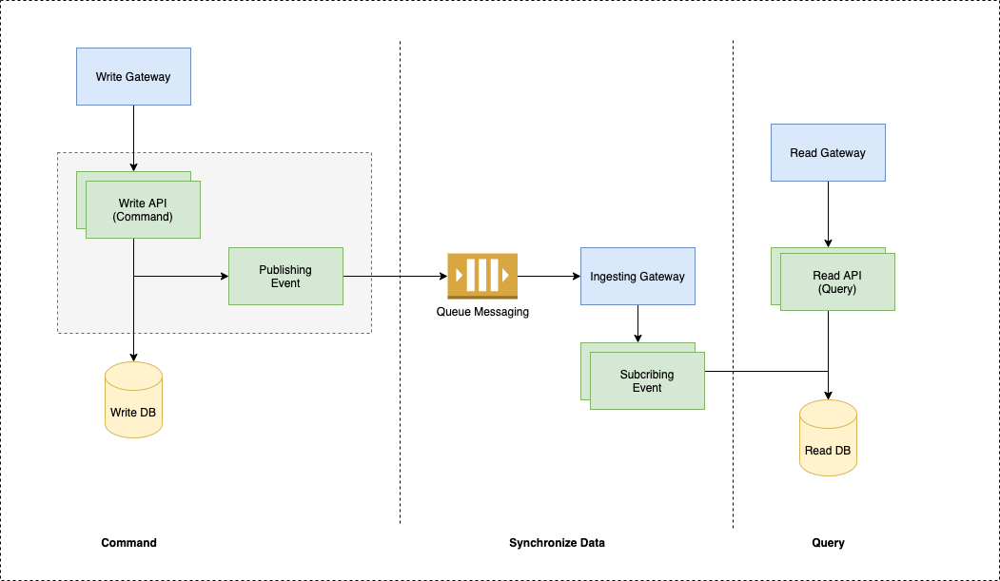

#### System Design
**Assumption**
The requirements request an system could use to operate data (create, read, update, delete). Ratio between modify data(create, update, delete) and search data (read) is 5% for creation and 95% for search data.

In this homework, we focus on solution to adapt requirements in branstorming phase so i skip the security in this solution.

This homework is designed for cloud environment using container.

The database from command and query could be different in structure in real-world. In this homework is the same for easy to adapt.

**Solution**

Based on the requirements, I realize that needs to separate the writing ability and reading ability to 2 flows for scaling ability. I design system follow through CQRS Pattern.

**Call For Service CQRS**

Command-Query Responsibility Segregation, CQRS for short, is an architectural pattern that prescribes a strict split within an application. A split between the part which deals with processing operations and the part which deals with answering questions. “Processing operations”, the “expressions of intent” targeted towards an application, is what is referred to as the Command side. “Answering questions”, the “request for information” about an application's state, is what is defined as the Query side of an application. CQRS thus suggests isolating the command and query components from one another.

Segregating these concerns introduces some consequences when writing software, but more importantly, it introduces several benefits.  First and foremost, it gives a single purpose to a component, increasing the focus on the problem at hand. The component is thus optimized for either dealing with commands or queries. This focus is highly beneficial when developing software.

Secondly, the segregation allows for dedicated deployments of the command and query side.

Non-functional requirements like differing scaling requirements can thus be achieved. Does the application have high demands for handling queries? Simply scale up the number of query instances of your application, without imposing any changes to the command handling part.

The same obviously holds if large amounts of state-changes should be processable; just introduce more command instances.

Benefits alongside the non-functional requirements reach a little further than just scaling. Different accessibility approached and data persistence options can be selected per side of the application. A different choice of database for the Command side compared to the Query side has now become trivial as they no longer rely on one another. Requirements for a more efficient way of storing the application state, to optimize for answering queries, is now a design option for an application.

**Command Model (Writing Flow)**

The Command Model is tasked with handling the expressions of intent which an application might have. Such an expression of intent, the command, in general, is a business operation that ideally maps to specific tasks that can be performed. Upon receiving the command, the model will decide whether that task can be executed at that point in time. The decisions making process when handling the command is driven by business logic within the domain the application resides in.

These commands can be simple state changes within the application or potentially trigger a multitude of side effects. To decide on this outcome, the Command Model will require some state. The state should by no means encompass all the data flowing through the application. The only information which is necessary for the Command Model is the information that is required to make the decisions; no more, no less. This focus on dealing with commands keeps the model concise, both in operations it should be able to do and state it should keep for that task.

**Query Model (Reading Flow)**

The Query Model, also referred to as “Projection” or “View Model”, will not deal with any expressions of intent to adjust state or perform some operation. Its sole purpose is to deal with requests for information. The requests for information, the queries, an application should be able to handle can come in very different formats, ranging from lookups based on an identifier to full-text searches on large sets of data. The query side of an application thus needs to support different approaches to retrieving the application's state.

Due to the decoupling of the command and query side with CQRS, we can quite easily any storage format for the Query Model without influencing the Command Model’s approach to storing its state to make decisions. It also allows implementing several storage approaches tailored towards the type of query which needs to be dealt with.

Is the query performed to fill JSON-based web page through a specific identifier? Use a denormalized view in your Query Model, which stores that page as JSON alongside the identifier in the NoSQL solution of your choosing. Are there requirements that the application should also provide a search box for users to query several documents based on keywords? Introduce a second Query Model using a search engine to support such requests.

The segregation allows optimizing the query for the exact use case to be as performant, flexible or storage efficient as possible. It will introduce data duplication and where needed data denormalization. This is however very desirable, as your model will focus on what it should return as best as it can, making the overall application more concise and reliable.

**Synchronization Data**

Even though CQRS breaks apart the Command and Query side into dedicated components, they are still part of the same application. As such, they need to synchronize. As the Command Model is in charge of handling the commands which incur states changes, it will notify the application that such a decision has been made. There are several ways to achieve this, with for example a shared data source between both models or through stored procedures. Using events as notifiers for the synchronization requirement is however the suggested solution.

When leveraging this Event Driven Architecture, the Command Model would thus publish an event upon (successfully) handling a command. The event will then be handled by the Query Model(s) to update it’s state accordingly. Following this pattern for synchronization also allows us to update the Command Model based on the events it publishes itself.

I used rabbitmq to operate publishing, subcribing event to synchronize data between command side and querey side. 

**Scaling Ability**

Following with this architecture design, It could do horizontal scaling for both command application and query application. Applying CQRS pattern to separate command application and query application that could do scaling independent (loose-coupling).

This system is build using docker container so adapt very well with some cloud providers (aws, gcp, pvc,..)

**Moving Cloud Environment AWS**
Deploying system to AWS cloud need some services:
1. Write-Gateway (AWS API Gateway)
2. Writing (AWS ECS)
3. Writing Database (AWS RDS)
4. Queue Messaging System (AWS SQS)
5. Subcribing (AWS ECS)
6. Reading (AWS ECS)
7. Reading Database (AWS RDS)

#### Database Design

**Normalize Database**

This diagram list all object from the requirement and build relation between them to understand deeply about the structure data.

**De-normalize Database**

**Realistic Database**

Sample Table CFS
event_id (UUID) | agency_id (UUID) | user_id (varchar) | event_number (varchar) | event_type_code (varchar) | event_time (timestamp) | dispatch_time (timestamp) | responder (varchar)
------------ | ------------- | ------------- | ------------- | ------------- | ------------- | ------------- | -------------
e6689d2b-eb17-4dd9-9a1d-842119e132e9 | 562c89de-f140-4482-8ef5-5f1703b286b6 | USER_001 | 3234039 | SMO | 2020-11-25 00:00:04 | 2020-11-27 00:00:04 | OFFICER_001

Data in Reading Flow

Data in Writing Flow

#### Technology & Tool 
1. Springboot (Springboot Framework)
2. Spring data rest (Springboot Component)
3. Spring data jpa (Springboot Component)
4. Java 8 (Programming Language)
6. Postgres (Relational Database)
7. RabbitMQ (Queue messaging) 
8. Docker (Build Container)
9. Postman (Smoke Test)
10. Jmeter (Load Test)
11. AWS Cloud (API Gateway, ECS, SQS, RDS, CloudWatch)
12. Drawio (Drawing Diagram: https://app.diagrams.net/)
13. IntelliJ Idea Edu (Coding)
14. DBeaver (Database Tool)
14. Git

#### Guide
***Structure Folder Project***
1. design_material
contain design diagrams that need Drawio to view.
2. db 
contain db schema of 2 database (cfs_write, cfs_read)
3. implementation
contain src_code of project
4. docker
contain material to build docker file
5. testing
contain material use for testing
6. img
contain images use to display in README.md file

***How to run project*** 
* CFS could run by manual creating docker image and run by docker-compose.yml

* CFS project have put in hub.docker.com. The maintainer is hieung (me). The project could run directly from here and needn't some build steps by manual. 

***Services and ports*** 
* Postgres Database Services - Port: 5432
* RabbitMQ Queue Services - Port: 5672,15672
* Writing Application - Port: 8887
* Subcribing Application - Port: 8886
* Reading Application - Port: 8888

#### Docker Build Images
1. Reading application
>cd implementation/cfs/reading/
>docker build -t hieung/reading-cfs:1.0.0 .
2. Writing application
>cd implementation/cfs/writing/
>docker build -t hieung/writing-cfs:1.0.0 .
3. Subcribing application
>cd implementation/cfs/subcribing/
>docker build -t hieung/subcribing-cfs:1.0.0 .
4. Database Postgres
>cd docker/postgres
>docker build -t hieung/postgres-cfs:1.0.0 .
5. Messaging Queue: Rabbitmq
>cd docker/rabbitmq
>docker build -t hieung/rabbitmq-cfs:1.0.0 . 

Run By docker-compose
>cd docker
>dock-compose up -d

#### Testing
***Mock Test Postman API***

Postman collection JSON is at testing/postman_collection. Import to postman to have nice view.

***Mock Test by CURL***
* Create CFS API  (Command - Writing API)
>curl -X POST 'http://localhost:8887/v1/api/cfs' -H 'Content-Type: application/json' --data-raw '{
    "agencyId": "562c89de-f140-4482-8ef5-5f1703b286b6",
    "userId": "USER_001",
    "eventNumber": "3234022",
    "eventTypeCode": "SMO",
    "eventTime": "2020-11-25 07:36:04.193",
    "dispatchTime": "2020-11-26 13:55:46.466",
    "responder": "OFFICER_001"
}'

* Search API by time range have paging and sorting (Query - Reading API)
>curl -X GET 'http://localhost:8888/v1/api/searchCfsForTimeRange?from=2020-11-25%2000:00:04&to=2020-11-27%2000:00:04&agencyId=562c89de-f140-4482-8ef5-5f1703b286b6&size=4&page=0&sort=userId,asc'

* Search API by responder (Query- Reading API)
>curl -X GET 'http://localhost:8888/searchCfsByResponder?responder=OFFICER_001&agencyId=562c89de-f140-4482-8ef5-5f1703b286b6'

***Load Test By Jmeter***
Jmeter Testing file put in testing/jmeter/

#### Disadvantages and Enhancement
***Disadvantages***
This project describe the detail of implementation of CQRS architecture, and do the POC (proof of concept). Not fully run scaling on local machine because i do not build api gateway applicaion. To run in cloud environment we need some step setup on cloud provider.

***Enhancement***
Apply fully Spring Cloud to have full micoservice architecture.
Spring Cloud Config
Spring Cloud Discovery
Spring Cloud Gateway
Sping Cloud Tracing
...

